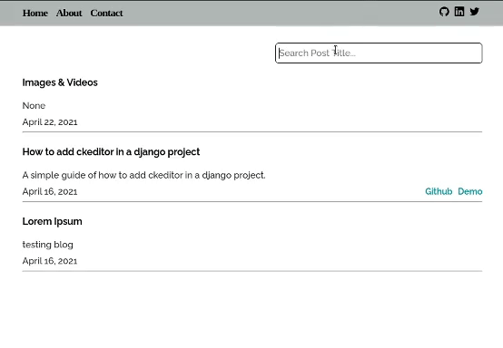

# Django Blog
#### Video Demo:  [My youtube video link](https://www.youtube.com/watch?v=LEiuBfLsiSY).
#### Description:  This is a simple blog project maked with python django framework and Javascript.  

### Why django framework  
About django framework https://www.djangoproject.com/  
Django is a python framework.
Is a robust and secure framework to make the backend of a web app.  
We can create a django project and create or install one or more apps (features) inside the project.  
I have install django-ckeditor to create posts.  
For more info and how to install and use ckeditor [django-ckeditor github page](https://github.com/django-ckeditor/django-ckeditor).  

### setting.py file configuration in django
Django use a file called settings.py to configure a project.  
Here are writen all the settings like: database, security, the settings of the apps we install, etc..  

### Static folder
The static folder is where all static files for the frontend are saved.  
Like: css, javascript, html, images, etc..  

### models.py - How i wrote the database fields with django
In a django app we have the models.py file where we can write our tables and columns.  
The table and columns of this project:  
```python
class Post(models.Model):
    headline = models.CharField(max_length=200)
    sub_headline = models.CharField(max_length=200, null=True, blank=True)
    body = RichTextUploadingField(null=True, blank=True) # ckeditor field
    created = models.DateTimeField(auto_now_add=True)
    updated = models.DateTimeField(auto_now=True)
    draft = models.BooleanField(default=False)
    slug = models.SlugField(null=True, blank=True)
    github = models.URLField(max_length=200, null=True, blank=True)
    demo = models.URLField(max_length=200, null=True, blank=True)
```

### urls.py file
when a user make a url request tell django where to see for the data to render.
```python
urlpatterns = [
    path('', views.home, name='home'),
    path('about/', views.about, name='about'),
    path('contact/', views.contact, name='contact'),
]
```
here when a user go to home url we look in the home function inside views.py file.  

### views.py file
In views.py we write the functions (the views) to tell django what to do with our data stored in database.  
example:  
```python
def home(request):
    posts = Post.objects.filter(draft=False).order_by('-created')
    context = {'posts':posts}
    return render(request, 'blog/home.html', context)
```
So here we write the code for our home page, when a user request the home page we filter all posts in our (database) Post class in models.py and show the data in the home.html page.

### template files
The html pages are saved inside template folder and are writen in a backend template language called [Django template language (DTL)](https://docs.djangoproject.com/en/3.2/topics/templates/) or [jinja2](https://github.com/pallets/jinja).  
See the code examples inside the template folder in this project.  
Here is how the code looks like in home.html file:  
```html





<section class="projects">
    <div class="projects-container">
        <div class="search">
            <input type="text" id="myInput" onkeyup="myFunction()" placeholder="Search Post Title...">
        </div>
        <main id="projects" class="projects-wraper">
            
            <article class="post">
                <a href=""><h3 class="post-title">{{post.headline}}</h3></a>
                <p class="post-intro">{{post.sub_headline}}</p>
                <div class="meta">
                    <time>{{post.created | date}}</time>

                    <div class="tags"> 
                        
                            <a href="{{post.github}}"target="_blank"><b>Github</b></a>
                        
                        
                            <a href="{{post.demo}}"target="_blank"><b>Demo</b></a>
                        
                    </div>
                </div>
                <hr>
            </article>

            
        </main>
    </div>
</section>


```
### Live search posts with vanilla javascript
I loop throught title posts and show only the titles that contains the letters we search.  



### Contact form
I write a simple contact form and send emails to my address email using django [EmailMessage](https://docs.djangoproject.com/en/3.2/topics/email/#emailmessage-objects).  
In the contact.html page when a user submit, I send the message email in my google address from the same address.  
For more see the code in views.py, urls.py, settings.py, contact.html, email_sent.html and email_template.html.